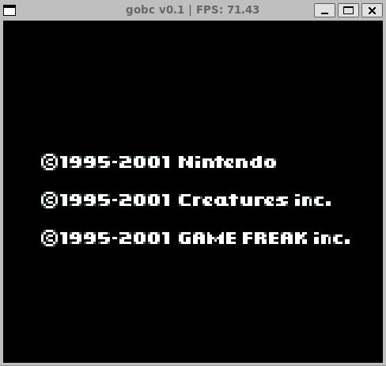
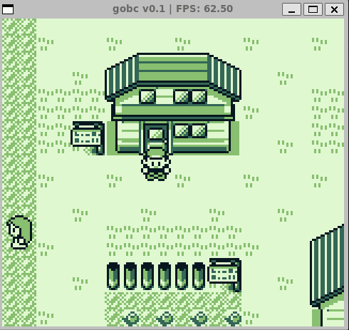
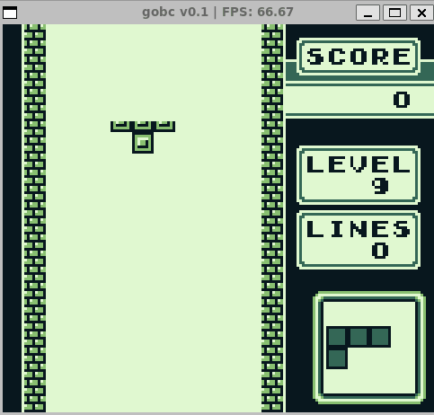
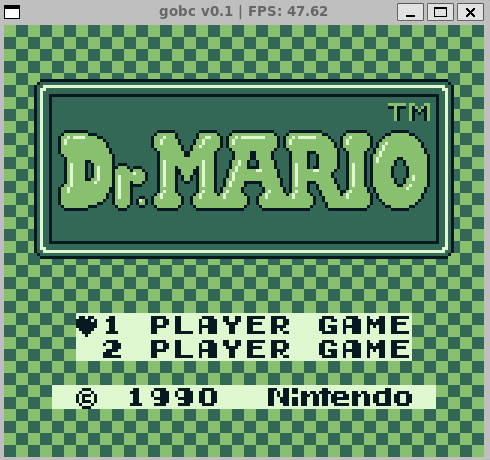
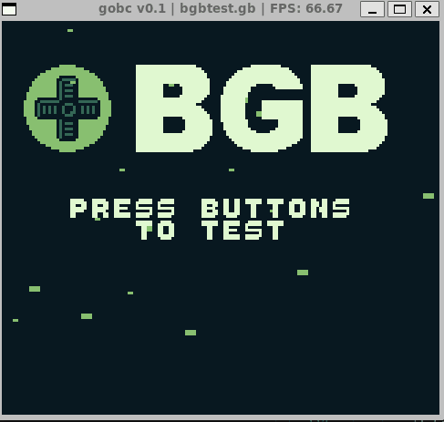
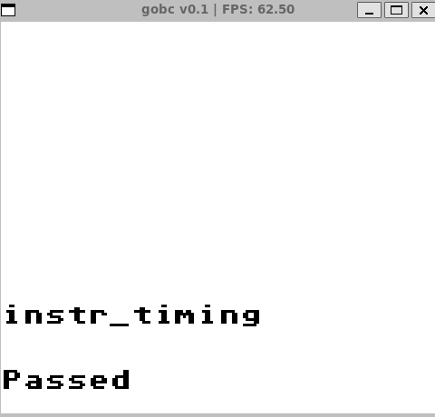
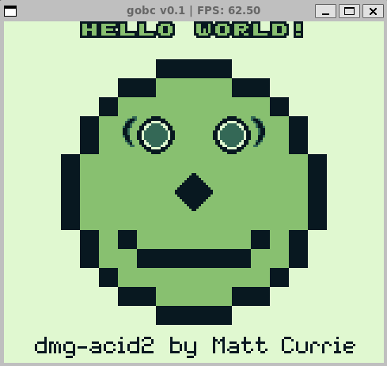
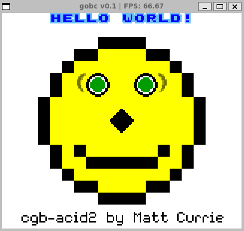
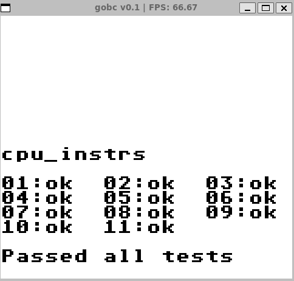

<p align="center">

</p>

__If you have any questions, or just want to chat, [join us on Discord](https://discord.gg/eZg8bEYy).__


Standing on the shoulders of giants, this is a fun project to create, _yet another_, GameBoy emulator. 

<!---
Generate GIF with the layout and captions
-->
<table>
  <tbody>
      <tr>
      <td align="center">
        
      </td>
      <td align="center">
        
      </td>
            <td align="center">
        
      </td>
    </tr>
      <tr>
      <td align="center">
        
      </td>
            <td align="center">
        
      </td>
      <td align="center">
        
      </td>
    </tr>
    <tr>
    </tr>
    <tr>
      <td align="center">
        
      </td>
      <td align="center">
        
      </td>
      </td>
            <td align="center">
        
      </td>
    </tr>
  </tbody>
</table>

Supported Features
==================
- [x] CPU
  - [ ] Double Speed Mode
- [ ] Sound
- [x] Interrupts
- [x] Joypad
- [ ] Serial
- [ ] Cartridges
    - [x] Cartridge RAM_ONLY
    - [x] Cartridge MBC1
    - [ ] Cartridge MBC2
    - [x] Cartridge MBC3
    - [ ] Cartridge MBC5
    - [ ] Cartridge HuC1
    - [ ] Cartridge HuC3
    - [ ] Cartridge MMM01
    - [ ] Cartridge Pocket Camera
    - [ ] Cartridge Bandai TAMA5
    - [ ] Cartridge Hudson HuC-1
    - [ ] Cartridge Hudson HuC-3
- [x] Graphics 
  - [ ] FIFO
- [x] Timers
- [x] CGB Mode

Future Features
==================
List is in no particular order and is subject to change. Take a stab at any of them if you feel like it.

- [ ] Sound
- [ ] Use real Cartridges (via Arduino)
- [ ] Implement all MBCs
- [ ] Fix Links Awakening DMG (Menu is broken)


Installing GoBC
============
You need the following dependencies installed:
- [Go](https://golang.org/doc/install)
- [OpenGL](https://github.com/faiface/pixel#requirements)

Building from source
```bash 
go build -o bin/gobc cmd/gobc/gobc.go
```

Or Install latest binary
```bash
go install github.com/duysqubix/gobc/cmd/gobc@latest
```

Usage 
========

```bash
NAME:
   gobc - A Gameboy emulator written in Go

USAGE:
   gobc ROM_File [options] 

VERSION:
   0.0.1

AUTHOR:
   duys <duys@qubixds.com>

COMMANDS:
   help, h  Shows a list of commands or help for one command

GLOBAL OPTIONS:
   --debug              Enable debug mode (default: false)
   --breakpoints value  Define breakpoints
   --force-cgb          Force CGB mode (default: false)
   --force-dmg          Force DMG mode (default: false)
   --no-gui             Run without GUI (default: false)
   --panic-on-stuck     Panic when CPU is stuck (default: false)
   --randomize          Randomize RAM on startup (default: false)
   --help, -h           show help
   --version, -v        print the version


Examples:

gobc roms/cpu_instrs.gb --debug --breakpoints 0x100,0x200,0x300 # Run with debug mode and breakpoints
gobc roms/cpu_instrs.gb --force-cgb # Force CGB mode on DMG rom
gobc roms/cpu_instrs.gb --force-dmg # Force DMG mode on CGB rom
LOG_LEVEL=debug gobc roms/cpu_instrs.gb # Set Log level to debug
LOG_LEVEL=info gobc roms/cpu_instrs.gb # Set Log level to info
```

Key Bindings
============
Main Window
-----------
| Key | Description |
| --- | ----------- |
| `F1` | Toggle Grid |
| `F2` | Toggle Debug Information |
| `F3` | Change Pallete (DMG Only) |
| `F4` | Save Cartridge SRAM |
| `F5` | Save State |
| `F6` | Load State |
| `A` | Button B |
| `S` | Button A |
| `Enter` | Start |
| `Shift` | Select |
| `Up` | D-Pad Up |
| `Down` | D-Pad Down |
| `Left` | D-Pad Left |
| `Right` | D-Pad Right |
| `DEBUG ON - Space Bar` | Game Pause |
| `DEBUG ON - N` | Step N Cycles |
| `DEBUG ON - M` | Increase Cycles Per Frame 10x |
| `DEBUG ON - B` | Decrease Cycles Per Frame 10x |
| `DEBUG ON - F` | Step Frame |

VRAM Window
-----------
| Key | Description |
| --- | ----------- |
| `T` | Toggle Tile Addressing Mode|
| `B` | Toggle TileMap Addressing Mode|
| `G` | Toggle Grid |
| `V` | Toggle VRAM bank 0/1 |

Memory Window
-----------
| Key | Description |
| --- | ----------- |
| `Right` | Page Down |
| `Left` | Page Up |
| `Up` | Scroll Up |
| `Down` | Scroll Down |
| `Mouse Wheel Up` | Scroll Up |
| `Mouse Wheel Down` | Scroll Down |

Cart Window
-----------
| Key | Description |
| --- | ----------- |
| `Right` | Page Down |
| `Left` | Page Up |
| `Up` | Scroll Up |
| `Down` | Scroll Down |
| `Mouse Wheel Up` | Scroll Up |
| `Mouse Wheel Down` | Scroll Down |


Contributors
============

Thanks to all the people who have contributed to the project and we welcome anyone to 
join and help out!

Original Developers
-------------------

 * Duan Uys- [duysqubix](https://github.com/duysqubix)


Contribute
==========
Any contribution is appreciated. The currently known problems are tracked in the Issues tab. Feel free to take a swing at any one of them.

If you want to implement something which is not on the list, feel free to do so anyway. If you want to merge it into our repo, then just send a pull request and we will have a look at it.
