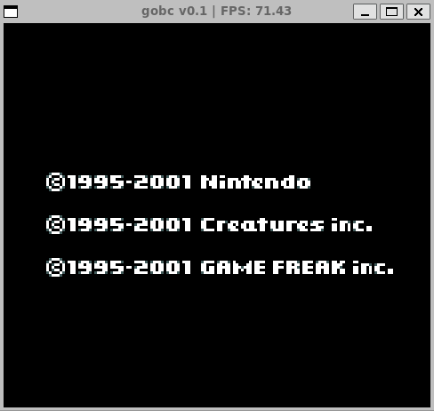
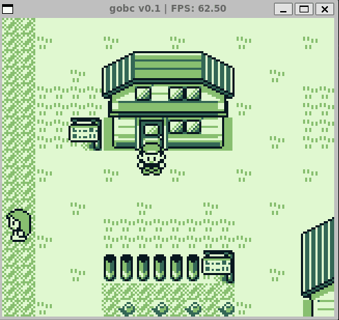
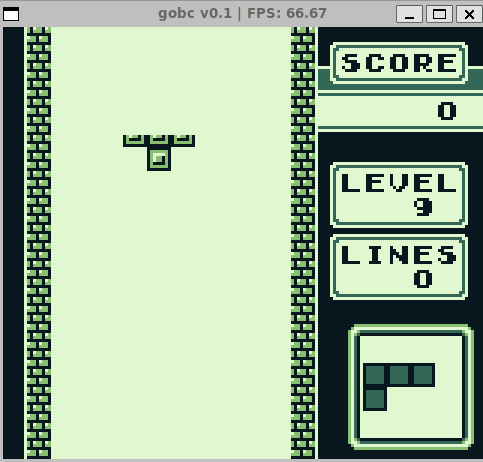
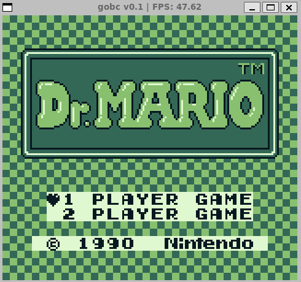
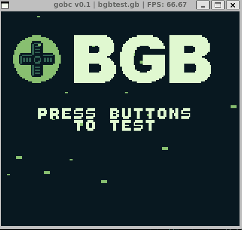
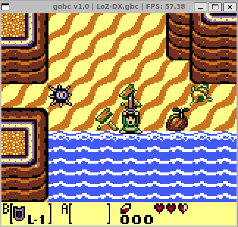

<p align="center">

</p>

<p align="center">
<a href="https://github.com/duysqubix/gobc/actions/workflows/go.yml"></a>
<a href="https://codecov.io/gh/duysqubix/gobc"></a>
<a href="https://goreportcard.com/report/github.com/duysqubix/gobc"></a>
<a href="https://pkg.go.dev/github.com/duysqubix/gobc"></a>
<a href="https://github.com/duysqubix/gobc/releases/latest"></a>
</p>

**gobc** is a Game Boy / Game Boy Color emulator written in Go. Standing on the
shoulders of giants — Pan Docs, SameBoy, PyBoy, mooneye, gbdev — it aims to be
a fast, hackable, hardware-accurate emulator with a real focus on passing the
canonical test suites (Blargg, Mooneye) rather than just "running games".

[**📋 Tests passing →**](TESTS.md) &nbsp;&nbsp;
[**🎵 Audio setup →**](docs/audio_tests.md) &nbsp;&nbsp;
[**💬 Discord →**](https://discord.gg/EVCX5X3A) &nbsp;&nbsp;
[**📦 Latest release →**](https://github.com/duysqubix/gobc/releases/latest)

<!---
Generate GIF with the layout and captions
-->
<table>
  <tbody>
      <tr>
      <td align="center">
        
      </td>
      <td align="center">
        
      </td>
            <td align="center">
        
      </td>
    </tr>
      <tr>
      <td align="center">
        
      </td>
          <td align="center">
        
      </td>
          <td align="center">
        
      </td>
    </tr>
    <tr>
    </tr>
  </tbody>
</table>

## Feature matrix

Legend: ✅ = full hardware accuracy (regression-guarded in CI) &nbsp;·&nbsp; 🟡 = partial / WIP &nbsp;·&nbsp; ❌ = not started

| Subsystem | Status | Notes |
|---|:-:|---|
| SM83 CPU | ✅ | All 245 implemented opcodes + CB-prefix; passes Blargg `cpu_instrs` 11/11 + `instr_timing`. Atomic-instruction model — sub-instruction T-cycle timing is [#18](https://github.com/duysqubix/gobc/issues/18). |
| Interrupts | ✅ | EI 1-instruction delay, HALT bug, peripherals ticked during ISR. Passes `interrupt_time` and `halt_bug`. |
| Joypad | ✅ | All 8 buttons, D-pad + face buttons + Start/Select. |
| Timers (DIV/TIMA) | ✅ | Including CGB double-speed scaling. |
| LCD / PPU | ✅ | Tile + sprite render, STAT interrupts, mode 0/1/2/3 transitions, BG-OBJ priority. Pixel-FIFO accuracy and cycle-accurate mode 2 timing tracked in [#19](https://github.com/duysqubix/gobc/issues/19). |
| **APU (sound)** | ✅ | **NEW in v2.0.** Full 4-channel emulation on `gopxl/beep/v2`. Square × 2 with NR10 sweep, wave with 32-sample wave RAM, noise with 7/15-bit LFSR, frame sequencer at 512 Hz. **Passes all 12/12 Blargg `dmg_sound` AND all 12/12 `cgb_sound`.** Setup guide: [`docs/audio_tests.md`](docs/audio_tests.md). |
| CGB mode | ✅ | BG / OBJ palette RAM, VRAM bank switching, double-speed switching via STOP + KEY1, APU scaling. |
| Serial port | ❌ | Output captured for test ROMs; full serial transfers / link cable: [#11](https://github.com/duysqubix/gobc/issues/11). |
| Save / load states | ✅ | Snapshot the full Motherboard (CPU + memory + cart + APU + PPU). |
| Debugger | ✅ | VRAM viewer, tile data + tilemap, CPU registers, IO regs, cart RAM browser, breakpoints, single-step. |
| Shaders | ❌ | CRT / LCD / GBC palette post-processing: [#17](https://github.com/duysqubix/gobc/issues/17). |

### Cartridge MBC support

| MBC | Status | Issue |
|---|:-:|---|
| ROM_ONLY (no MBC) | ✅ | — |
| MBC1 (+ RAM + BATTERY) | ✅ | — |
| **MBC2** | ❌ | [#3](https://github.com/duysqubix/gobc/issues/3) |
| MBC3 (+ RTC + RAM + BATTERY) | ✅ | — |
| MBC5 (+ RAM + BATTERY + RUMBLE) | ✅ | — |
| **MMM01** (multi-game compilations) | ❌ | [#14](https://github.com/duysqubix/gobc/issues/14) |
| **HuC1** (Hudson IR) | ❌ | [#12](https://github.com/duysqubix/gobc/issues/12) |
| **HuC3** (Hudson IR + RTC + speaker) | ❌ | [#13](https://github.com/duysqubix/gobc/issues/13) |
| **Pocket Camera** ($FC) | ❌ | [#15](https://github.com/duysqubix/gobc/issues/15) |
| **Bandai TAMA5** ($FD) | ❌ | [#16](https://github.com/duysqubix/gobc/issues/16) |

### Blargg test ROM scorecard (regression-guarded in CI)

| Suite | gobc v2.0 | Notes |
|---|:-:|---|
| `cpu_instrs` | ✅ PASS | All 11 sub-tests. |
| `instr_timing` | ✅ PASS | |
| `halt_bug` | ✅ PASS | |
| `interrupt_time` | ✅ PASS | Both DMG and CGB double-speed iterations. |
| `dmg_sound` | ✅ **12/12** | All 6 DMG quirks (length-clock-on-trigger, NR41 power-off, wave RAM bus contention, wave retrigger corruption, etc.). |
| `cgb_sound` | ✅ **12/12** | DMG-vs-CGB-aware quirks; same code paths gated on `mb.Cgb`. |
| `oam_bug` | 🟡 2/8 | Scaffolding in place ([commit](https://github.com/duysqubix/gobc/commits/master)); tuning tracked in [#19](https://github.com/duysqubix/gobc/issues/19). |
| `mem_timing` / `mem_timing-2` | ❌ | Requires sub-instruction T-cycle accurate CPU. Tracked in [#18](https://github.com/duysqubix/gobc/issues/18). |

## Installing

You need:
- [Go 1.26+](https://golang.org/doc/install)
- [OpenGL + GLFW](https://github.com/gopxl/pixel#requirements) (`libgl1-mesa-dev xorg-dev` on Debian/Ubuntu)
- Audio (optional): on WSL2, follow the one-time setup in [`docs/audio_tests.md`](docs/audio_tests.md#wsl2-setup-one-time)

```bash
# Option 1 — pre-built release binary (Linux x86_64)
curl -L https://github.com/duysqubix/gobc/releases/latest/download/gobc-v2.0-linux-x86_64 -o gobc
chmod +x gobc

# Option 2 — go install
go install github.com/duysqubix/gobc/cmd/gobc@latest

# Option 3 — build from source
git clone https://github.com/duysqubix/gobc && cd gobc
cargo install just                # or: brew install just / apt install just
just bootstrap                    # installs Go (if missing) + gopls + staticcheck + dlv + goimports
just install-hooks                # wires the repo pre-commit hook (gofmt + vet + staticcheck)
just build                        # vet + race-test + compile to bin/gobc + bin/cartdump
just build-release                # stripped (-trimpath -s -w) release binary
```

The project uses [`just`](https://github.com/casey/just) as its task runner. Run `just` with no
arguments to list every recipe. Useful environment overrides:

| Env | Effect |
|---|---|
| `GO_VERSION=1.27.0 just bootstrap` | Pin a specific Go release. |
| `GO_INSTALL_DIR=$HOME/.local just bootstrap` | Install Go to a user-local prefix (no sudo). |
| `COVER_MIN=70 just test-cover-check` | Fail if line coverage drops below 70 %. |

## Usage

`gobc` exposes two subcommands plus a shorthand:

| Command | Purpose |
|---|---|
| `gobc run ROM_File [options]` | Boot the emulator and run a ROM. |
| `gobc cartdump ROM_File [options]` | Dump cartridge header (and optional opcode disassembly). |
| `gobc ROM_File [options]` | Shorthand for `gobc run`. |

```bash
# Run a ROM
gobc run roms/cpu_instrs.gb
gobc run roms/zelda.gb              --debug --breakpoints 0x100,0x200,0x300
gobc run roms/pokemon.gb            --force-cgb        # force CGB on a DMG ROM
gobc run roms/blargg.gb             --no-gui           # headless (CI / test ROMs)
LOG_LEVEL=debug gobc run roms/zelda.gb

# Audio (new in v2.0)
gobc run roms/crystal.gbc           --audio-rate 32000 # match host throughput on slow CPUs
gobc run roms/crystal.gbc           --audio-smooth     # calibrate to host (5% pitch trade-off)
gobc run roms/crystal.gbc           --no-audio         # silent run

# Inspect a cartridge
gobc cartdump roms/pokemon.gb                                     # writes cartdump.txt
gobc cartdump --raw roms/pokemon.gb                               # raw header to stdout
gobc cartdump --instruction-set --include-nop -o dump.txt roms/pokemon.gb
```

Run `gobc --help` for the full flag reference and `gobc <command> --help` for per-subcommand help.

## Key bindings

### Main window

| Key | Action |
|---|---|
| `F1` | Toggle gridlines |
| `F2` | Toggle debug viewer windows (VRAM / Memory / Cart / CPU / IO) |
| `F3` | Cycle DMG palette |
| `F4` | Save cartridge SRAM to `<rom>.sav` |
| `F5` | Save state to `<rom>.state` |
| `F6` | Load state from `<rom>.state` |
| `A` | Game Boy B button |
| `S` | Game Boy A button |
| `Enter` | Start |
| `Shift` | Select |
| Arrow keys | D-pad |
| `Space` *(debug on)* | Pause / resume emulation |
| `N` *(debug on)* | Step **N** CPU cycles |
| `M` / `B` *(debug on)* | Increase / decrease cycles-per-frame 10× |
| `F` *(debug on)* | Step one frame |

### Debug viewers

| Window | Keys |
|---|---|
| VRAM | `T` toggle tile addressing · `B` toggle tilemap addressing · `G` toggle grid · `V` toggle VRAM bank 0/1 |
| Memory | Arrow keys page/scroll · mouse wheel scrolls |
| Cart | Arrow keys page/scroll · `[` / `]` switch RAM bank |

## Testing

Unit tests use the stdlib `testing` package + `testify`. ROM integration tests under
`default_rom/` run `gobc --no-gui` against Blargg ROMs and grep the serial output (or
cart-RAM `.sav` for the newer `dmg_sound`/`cgb_sound`/`oam_bug` suites).

```bash
just test                            # go test -race ./...
just test-cover                      # writes coverage.out + summary
just test-cover-html                 # generates coverage.html
COVER_MIN=70 just test-cover-check   # fail if coverage drops below threshold
just bench                           # benchmarks
just test-rom-audio                  # runs the full 12-ROM dmg_sound matrix
```

Every push runs the full test pipeline + ROM integration suite on GitHub Actions; coverage
is uploaded to [Codecov](https://codecov.io/gh/duysqubix/gobc).

## Known game bugs

| Game | Symptom | Issue |
|---|---|---|
| Link's Awakening (DMG) | Main menu doesn't render | [#5](https://github.com/duysqubix/gobc/issues/5) |
| Pokémon Crystal | Battle scene doesn't animate | [#4](https://github.com/duysqubix/gobc/issues/4) |
| Pokémon Crystal | Character sprite split entering battle | [#4](https://github.com/duysqubix/gobc/issues/4) |

## Project layout

```
gobc/
├── cmd/
│   ├── gobc/             # main binary; urfave/cli/v2 app with run + cartdump subcommands
│   └── cartdump/         # standalone cart-dump binary (same logic as gobc cartdump)
├── internal/
│   ├── motherboard/      # CPU + opcodes + memory + timer + interrupts + PPU + APU
│   ├── cartridge/        # header parser + ROM_ONLY / MBC1 / MBC3+RTC / MBC5
│   ├── windows/          # Pixel/GLFW GUI: 1 main + 5 viewer windows
│   ├── bootrom/          # DMG + CGB boot ROMs as hex blobs
│   └── root.go           # shared utilities: Logger, constants, bit-ops, state save/load
├── default_rom/          # Blargg + Mooneye test ROMs
├── docs/                 # audio_tests.md and project docs
├── .githooks/            # repo-tracked pre-commit hook
├── .github/workflows/    # CI: unit tests + coverage + ROM integration
└── justfile              # task runner (run `just` to list recipes)
```

Each subdirectory has its own `AGENTS.md` with conventions, anti-patterns, and quirks. Start
with [`AGENTS.md`](AGENTS.md) (root) before contributing.

## Contributing

The known problems are tracked in the Issues tab — grab anything that looks interesting!
For substantial new features, open an issue first to align on the approach. We follow the
existing per-package conventions (see each subdirectory's `AGENTS.md`) and the pre-commit
hook enforces `gofmt`, `vet`, and `staticcheck`. Tests must stay green.

### Contributors

- Duan Uys — [@duysqubix](https://github.com/duysqubix)

## References

- [Pan Docs](https://gbdev.io/pandocs/About.html) — canonical Game Boy hardware reference
- [GBEDG](https://hacktix.github.io/GBEDG/) — Game Boy emulator development guide
- [pastraiser opcode table](https://www.pastraiser.com/cpu/gameboy/gameboy_opcodes.html)
- [SameBoy](https://github.com/LIJI32/SameBoy) — cycle-accurate reference emulator (consulted heavily for v2.0 APU + interrupt timing)
- [PyBoy](https://github.com/Baekalfen/PyBoy) — Python reference + huge inspiration; the v2.0 adaptive frame limiter is adapted from PyBoy's
- [Test ROMs Archive](https://gbdev.gg8.se/wiki/articles/Test_ROMs)
