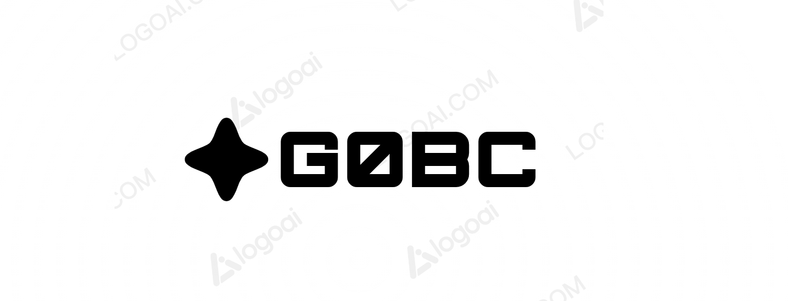

<p align="center">

</p>

__If you have any questions, or just want to chat, [join us on Discord](https://discord.gg/eZg8bEYy).__


Standing on the shoulders of giants, this is a fun project to create, _yet another_, GameBoy emulator in Golang. 

<!---
Generate GIF with the layout and captions
-->
<table>
  <tbody>
      <tr>
      <td align="center">
        
      </td>
      <td align="center">
        
      </td>
    </tr>
    <tr>
      <td align="center">
        
      </td>
      <td align="center">
        
      </td>
    </tr>
    <tr>
      <td align="center">
        
      </td>
      <td align="center">
        
      </td>
    </tr>
  </tbody>
</table>

Supported Features
==================
- [x] Emulated CPU (LR35902)
- [ ] DMG Sound
- [x] Interrupts
    * [x] V-Blank
    * [x] LCD STAT
    * [x] Timer
    * [] Serial
    * [] Joypad
- [ ] Cartridges
    - [x] Cartridge RAM_ONLY
    - [x] Cartridge MBC1
    - [ ] Cartridge MBC2
    - [x] Cartridge MBC3
    - [ ] Cartridge MBC5
    - [ ] Cartridge HuC1
    - [ ] Cartridge HuC3
    - [ ] Cartridge MMM01
    - [ ] Cartridge Pocket Camera
    - [ ] Cartridge Bandai TAMA5
    - [ ] Cartridge Hudson HuC-1
    - [ ] Cartridge Hudson HuC-3
- [x] Graphics 
- [x] Memory
- [x] Timers
- [x] CGB Mode
- [x] Opcodes


Installation
============
Compiled on Go 1.21.1, build each binary with 
```bash 
go build -o bin/cartdump cmd/cartdump/main.go && \  # Disassemble a ROM
go build -o bin/gobc cmd/gobc/main.go && \          # Main GoBC Emulator
go build -o bin/opbenchmark cmd/opbenchmark/main.go # Benchmark the CPU on current system
```


Contributors
============

Thanks to all the people who have contributed to the project and we welcome anyone to 
join and help out!

Original Developers
-------------------

 * Duan Uys- [duysqubix](https://github.com/duysqubix)


Contribute
==========
Any contribution is appreciated. The currently known problems are tracked in the Issues tab. Feel free to take a swing at any one of them.

If you want to implement something which is not on the list, feel free to do so anyway. If you want to merge it into our repo, then just send a pull request and we will have a look at it.