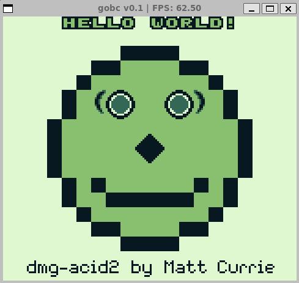
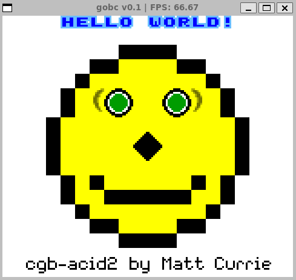
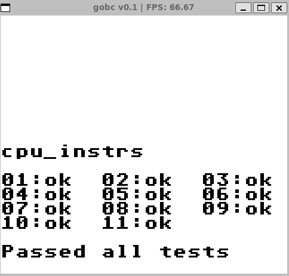
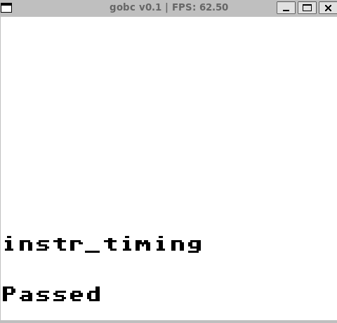
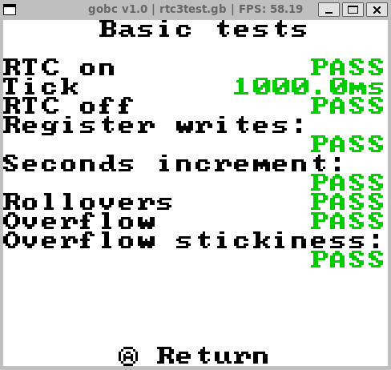
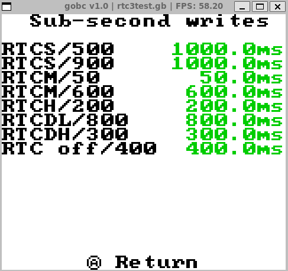
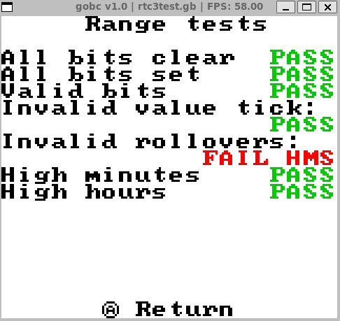

# Test Compatibility

**Blargg dmg_sound (audio):** 6/12 passing — see [docs/audio_tests.md](docs/audio_tests.md) for the per-test matrix and roadmap.

<table>
    <tbody>
        <tr>
            <td align="center">
                
            </td>
            <td align="center">
                
            </td>
            </td>
            <td align="center">
                
            </td>
        </tr>
        <tr>
            <td align="center">
                    
            </td>
                <td align="center">
                    
            </td>
            <td align="center">
                
            </td>
        <tr>
            <td align="center">
                    
            </td>
                <td align="center">
                    
            </td>
            <td align="center">
                
            </td>
        </tr>
    </tr>
    </tbody>
</table>